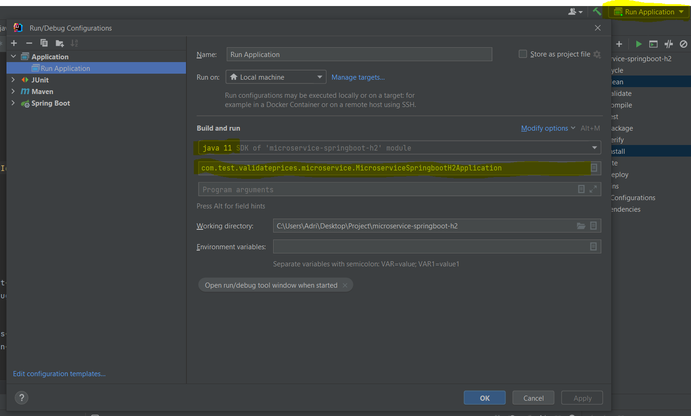

# Microservices with Spring Boot Project 

In this project I'm demonstrating Spring Boot feature for building microservice-based architecture. Based on Spring Boot 2.7.5.

## Getting Started

Currently you may find an example to calculating price rates depends on witch date and product you request for. 
For these you have an API exposed for consume.

### How to run

In order to run de application you need to have Maven and JDK11+. I recommend IDEs like IntelliJ IDEA or Eclipse. (sample extractc from IntelliJ)

Download de code above and open on your IDE editor, then test if compile rigth. Now have to set a run confoguration, and select the main class to run the app - MicroserviceSpringbootH2Application like the image below

One you have it, try to run it and see the Starting correctly on the log.

### How to test it
I pass 5 examples of data that you can test:

test1 - > productId:35455 brandId: 1 applicationDate: 2020-06-14 10:00:00

test2 - > productId:35455 brandId: 1 applicationDate: 2020-06-14 16:00:00

test3 - > productId:35455 brandId: 1 applicationDate: 2020-06-14 21:00:00

test4 - > productId:35455 brandId: 1 applicationDate: 2020-06-15 10:00:00

test5 - > productId:35455 brandId: 1 applicationDate: 2020-06-16 21:00:00

For these test you can use OpenApi swagger UI : http://localhost:8080/e-commerce/swagger-ui/index.html#/

Or create a new request on tool like PostMan : http://localhost:8080/e-commerce/validateRate?productId=35455&brandId=1&applicationDate=2020-06-14 10:00:00

### Considerations

On table PRICES, I create a unique primary key.

For the response added new field final Price to show up if needed.
